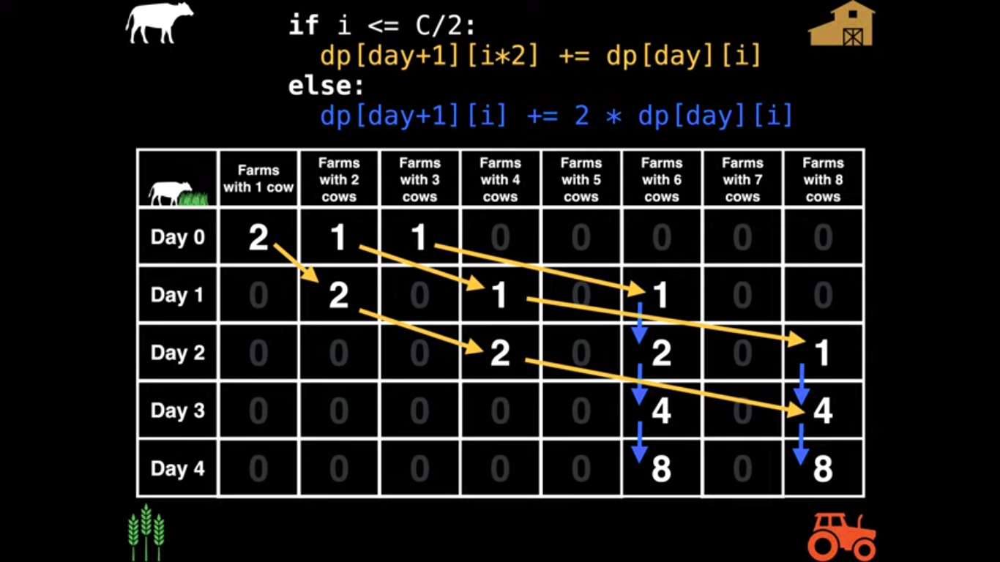

## Some common problems related to dynamic programming

### Magical Cows

Problem [link](https://open.kattis.com/problems/magicalcows)

Hint: Make a table of size max days+1 rows and C+1 columns. Refer this [video](https://www.youtube.com/watch?v=_tur2nPkIKo&list=PLDV1Zeh2NRsAsbafOroUBnNV8fhZa7P4u&index=2&ab_channel=WilliamFiset)



**Implementation**
```python
def cows(C,N,M,initial_cows,dp,queries):
	cows_on_query = []
	# count the initial frequency of farms of different sizes
	for i in range(N):
		dp[0][initial_cows[i]] += 1

	for day in range(MAX_DAYS):
		# for all farm sizes double the number of cows
		for i in range(1,C+1):
			if i <= C/2:
				# cow count on farm with size "i" doubled, but number of farms didn't
				dp[day+1][2*i] += dp[day][i]
			else:
				# number of cows/farm on farm with size "i" exceeds the permitted limit, so double the number of farms
				dp[day+1][i] += 2*dp[day][i] 

	for i in queries:
		day = i
		cows_on_query.append(sum(dp[day]))
	
	return cows_on_query

if __name__ == '__main__':
	MAX_DAYS = 50
	C = 2
	N = 5
	M = 3
	initial_cows = [1,2,1,2,1]
	queries = [0,1,2]

	dp =[[0 for _ in range(C+1)] for _ in range(MAX_DAYS+1)]
	print(cows(C,N,M,initial_cows,dp,queries))
```
