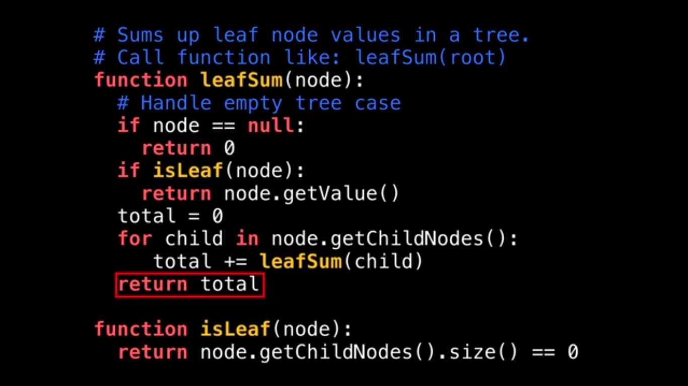
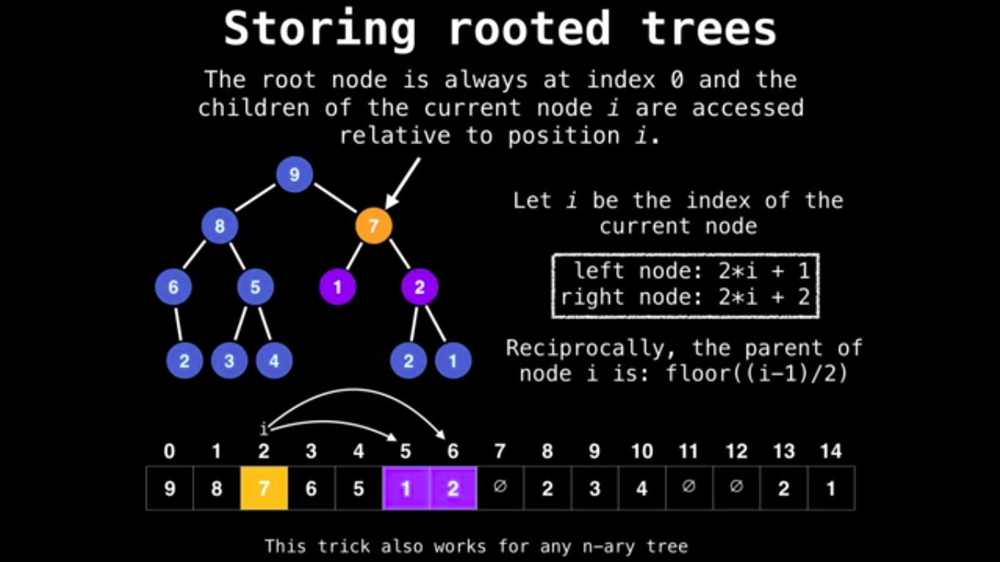
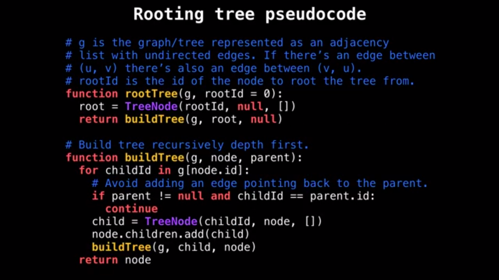

## Some common problems related to trees

### Maximum depth of binary trees
Problem [link](https://leetcode.com/explore/featured/card/top-interview-questions-easy/94/trees/555/)

Hint: Use recursion

**Implementation**
```python
# Definition for a binary tree node.
# class TreeNode:
#     def __init__(self, val=0, left=None, right=None):
#         self.val = val
#         self.left = left
#         self.right = right
class Solution:
    def maxDepth(self, root: TreeNode) -> int:
        if root == None: return 0
        
        if root.left == None and root.right == None:
            return 1
        
        return max(self.maxDepth(root.left), self.maxDepth(root.right))+1
```

### Validate Binary search tree
Problem [link](https://leetcode.com/problems/validate-binary-search-tree/)

Hint: Use recursion call stack

**Implementation**
```python
class Solution(object):
    def isValidBST(self, root):
        """
        :type root: TreeNode
        :rtype: bool
        """
        return self.validate(root, float('-inf'), float('inf'))

    def validate(self, tree, minimum, maximum):
        if tree == None: return True

        # validate
        if tree.val >= maximum or tree.val <= minimum: return False

        return self.validate(tree.left, minimum=minimum, maximum=tree.val) and self.validate(tree.right, minimum=tree.val, maximum=maximum)
```

### Symmetric Tree
Problem [link](https://leetcode.com/explore/featured/card/top-interview-questions-easy/94/trees/627/)

Hint: Traverse the tree with **BFS** at a level base, save the node values in a list called *level* even with value *None*

**Implementation**
```python
class Solution:
    def isSymmetric(self, root: TreeNode) -> bool:
        if not root: return True
        count = 0
        res = []
        queue = [root]

        while queue:
            level=[]
            qlen = len(queue)
            while qlen>0:
                temp = queue.pop(0)
                if temp is None:
                    level.append(None)
                    qlen -= 1 
                    continue
                level.append(temp.val)               
                queue.append(temp.left)
                queue.append(temp.right)
                qlen -= 1 

            res.append(level)
        
        for i in range(len(res)):
            if res[i] != res[i][::-1]:
                count += 1
            
        if count > 0: return False
        else: return True
```

### Binary Tree Level Order Traversal

Problem [link](https://leetcode.com/explore/featured/card/top-interview-questions-easy/94/trees/628/)

Hint: Use BFS

**Implementation**
```python
class Solution:
    def levelOrder(self, root: TreeNode) -> List[List[int]]:        
        if not root: return 
        queue = [root]
        res = []

        while len(queue)>0:
            level=[]
            for i in range(len(queue)):
                temp = queue.pop(0)
                level.append(temp.val)
                if temp.left:
                    queue.append(temp.left)
                if temp.right:
                    queue.append(temp.right)

            res.append(level)
        return res
```

### Path Sum

Problem [link](https://leetcode.com/problems/path-sum/)

Hint: Use recursion + DFS

**Implementation**
```python
class Solution:
    def hasPathSum(self, root: TreeNode, targetSum: int) -> bool:
        if not root: return False
        if not (root.left or root.right) and root.val != targetSum: return False
        if not (root.left or root.right) and root.val == targetSum: return True
        else:
            targetSum -= root.val
            return self.hasPathSum(root.left,targetSum) or self.hasPathSum(root.right, targetSum)
```
---






